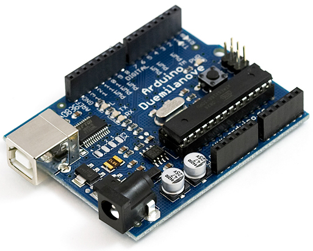
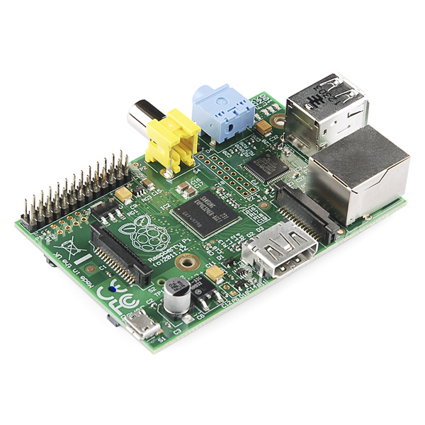
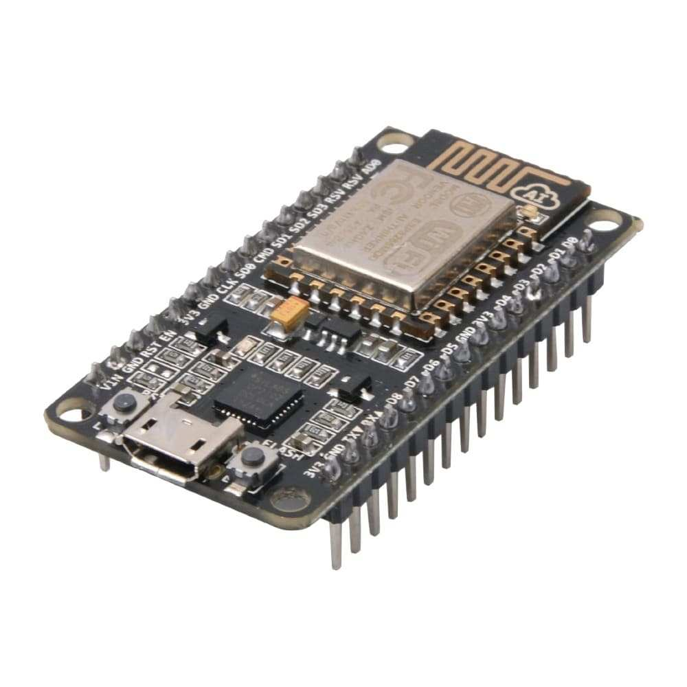
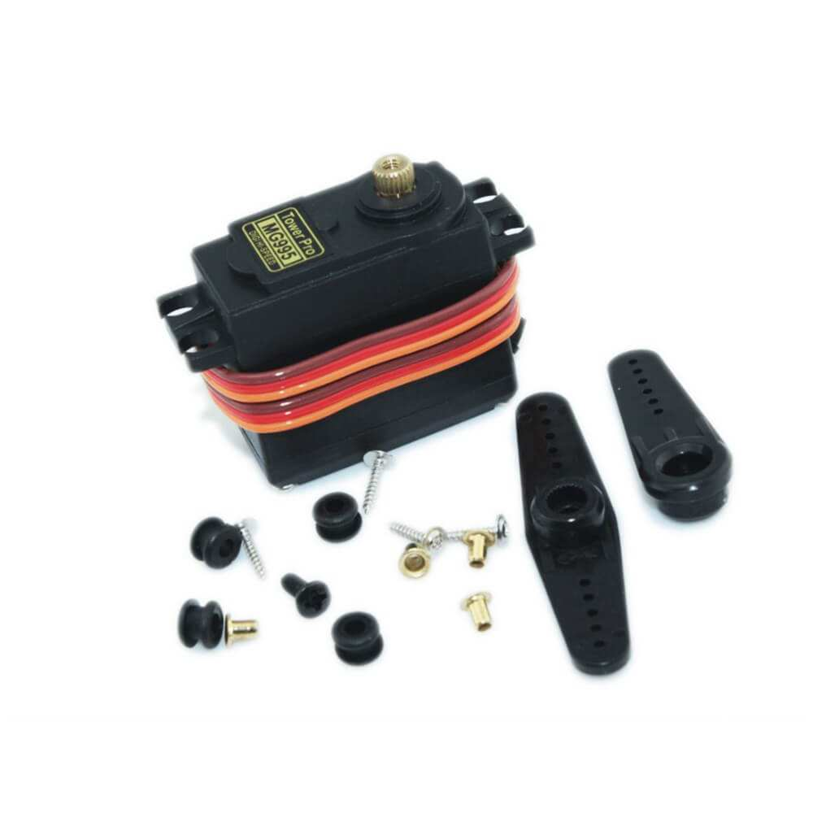
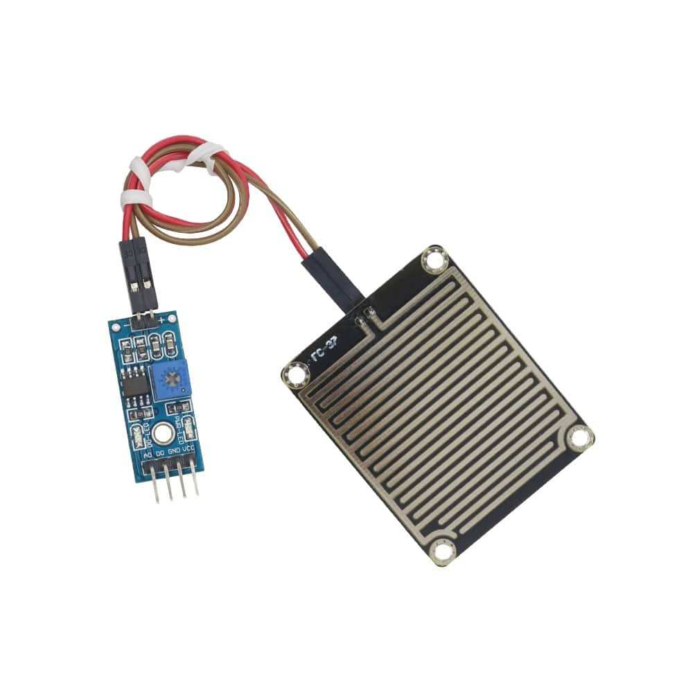
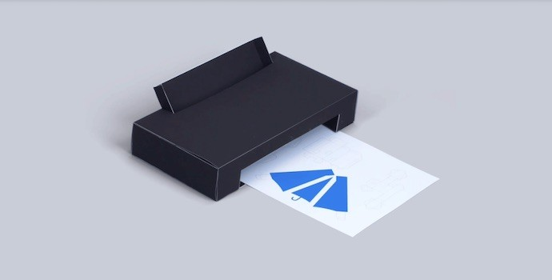

# Objetos Inteligentes Conectados 1 sem. 2018

## Projeto: "Chove Mas Não Molha"

## Integrantes do grupo:

* 41427981  Sergio A. Montini Jr. 05J
* 31638236  Sabrinna Delgado      05F
* 31535879  Lucas Pafume          05F

## Hardware Utilizado:

* Arduino

* Raspberry Pi

* NodeMCU

* Servo

* Sensor de chuva

* PaperSignal

