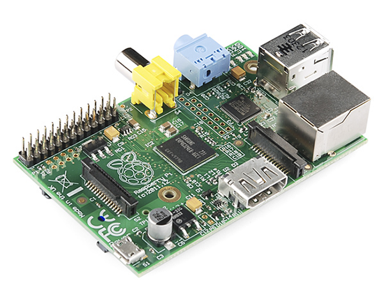
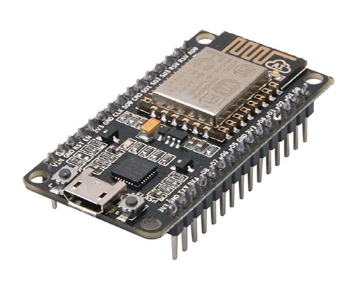
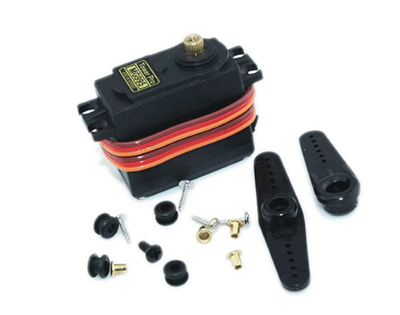
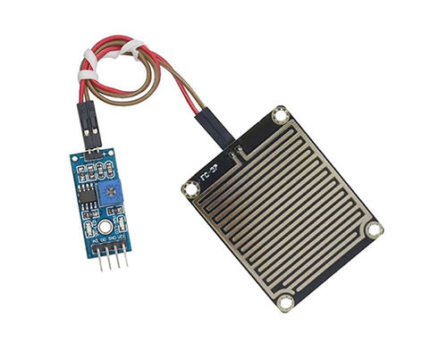

# Objetos Inteligentes Conectados 1 sem. 2018

## Projeto: "Chove Mas Não Molha"

## Integrantes do grupo:

* **41427981**  Sergio A. Montini Jr. - *05J*
* **31638236**  Sabrinna Delgado - *05F*
* **31535879**  Lucas Pafume - *05F*

## Documentação
* [Escopo do projeto](/docs/1-visao/index.md)

## Hardware Utilizado

### Arduino

### Raspberry Pi

### NodeMCU

### Servo

### Sensor de chuva

### PaperSignal

