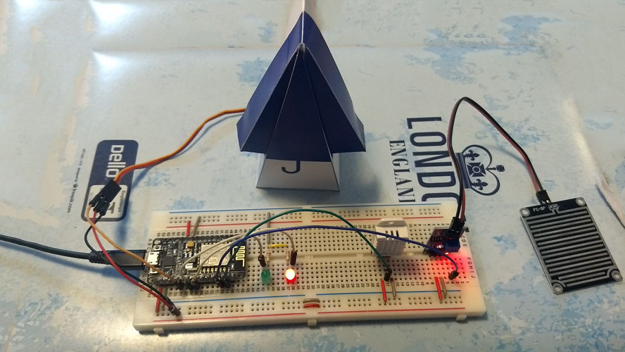

# Objetos Inteligentes Conectados - Prof. Dr. Wilian

## Projeto: "CHOVE MAS NÃO MOLHA"

## Integrantes do grupo:

* **41427981**  Sergio A. Montini Jr. - *05J*
* **31638236**  Sabrinna Delgado - *05F*
* **31535879**  Lucas Pafume - *05F*

## Conteúdo do Repositório

* **ENTREGA 1 [docs/hardware](/docs/hardware/index.md)**
* **ENTREGA 2 [docs/interfaces_e_comunicacao](/docs/interfaces_e_comunicacao/index.md)**
* **ENTREGA 3 [docs/software](/src/chove_mas_nao_molha.ino)**

# Visão do Projeto "CHOVE MAS NÃO MOLHA"

Este repositório apresenta uma solução de software e hardware para o projeto *"CHOVE MAS NÃO MOLHA"*, 
apresentando os problemas a serem solucionados, as necessidades dos principais envolvidos, o alcance do projeto e as funcionalidades esperadas.

## Objetivos

* Utilização do módulo NodeMCU como agregador dos sensores.
* Conectar um sensor de chuva ao NodeMCU.
* Conectar um sensor de temperatura/umidade ao NodeMCU.
* Acionamento de LEDs (verde e vermelho) indicando status de ambiente seco ou molhado.
* Conectar um micro-servo ao NodeMCU.
* Enviar via internet dados gerados a partir dos sensores, utilizando um broker MQTT.
* Acionar o micro-servo mediante a presença/detecção de chuva e abrir o guarda-chuva de papel.

## Problema

* Descrição do problema: Consequências negativas geradas pela falta de monitoramento em tempo real, sob efeito do grande volume de chuvas.
* Quem é afetado pelo problema: Pessoas, imóveis, comerciantes, indústrias, agro-negócio.
* Impacto no negócio: Agilidade na tomada de decisões decorrentes da chuva.
* Benefícios de uma boa solução: A prevenção de efeitos negativos causados pela chuva.

## Definições, abreviações e outros termos do domínio do problema

* NodeMCU: Dispositivo composto por um chip controlador (ESP8266 ESP-12E), uma porta micro USB para alimentação e programação, conversor USB serial integrado e WiFi nativo.
* Guarda-chuva: Dobradura em papel em formato de guarda-chuva.
 
## Interessados

* Indivíduos e setores que desejam monitorar em tempo real a presença de chuva em locais remotos.

## Usuários

* Pessoas comuns.
* Estudantes.
* Hobistas. 
* Empresas.
* Agro negócio.

## Funcionalidades do produto

* Monitoramento remoto da presença de chuva, via soluções MQTT.
* Acionamento do servo (abrir guarda-chuva de papel).
* Acionamento de LEDs de status (LED verde para clima seco, LED vermelho para molhado).

## Restrições do projeto

* Ter acesso à internet *(para comunicação com o Broker, via MQTT)*.
* A unidade deve estar conectada a uma fonte de energia.
* Apesar do micro-servo conseguir trabalhar sob 3.3V fornecido através do NodeMCU, é preferível que o mesmo seja alimentado por uma fonte externa de 5V.
