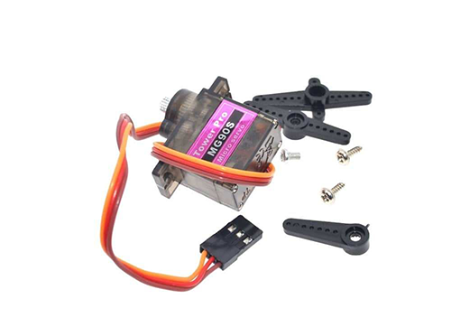
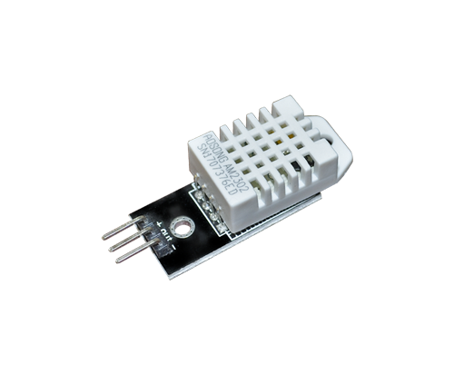
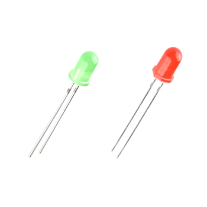
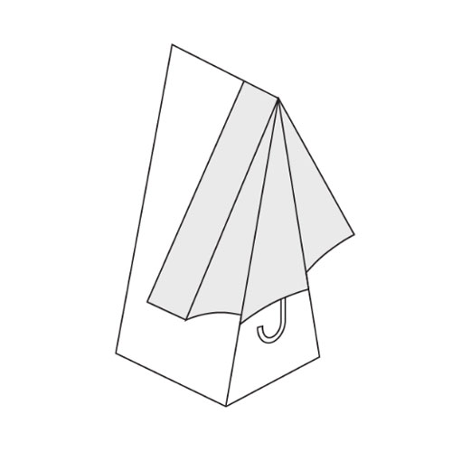
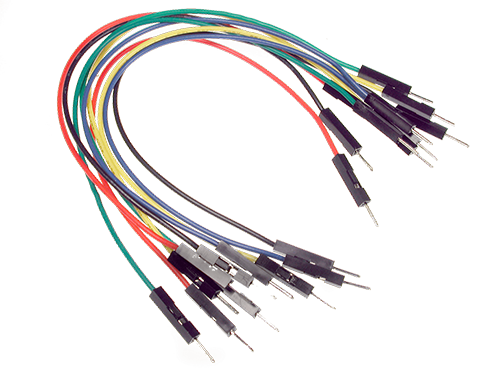
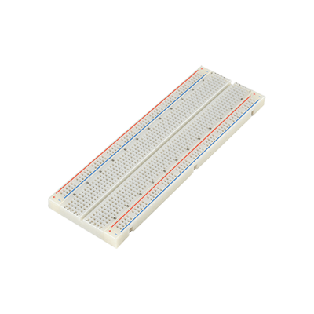
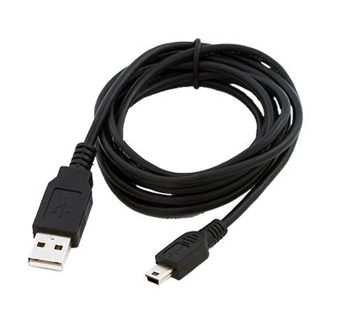
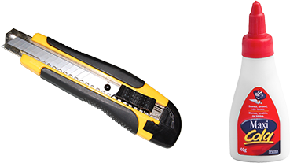

## Hardware Utilizado

### **NodeMCU ESP8266: 1x**

- Padrões wireless: IEEE 802.11b, IEEE 802.11g, IEEE 802.11n;
- Faixa de frequência: 2.4GHz;
- Taxa de transmissão: 110 à 460 Mbps;
- Antena Embutida;
- Interface: Serial UART (Tx / Rx);
- Segurança: WEP / WPA / TKIP / AES;
- Alimentação: 4,0 à 9,0 VDC (conector Micro USB);
- Tensão Lógica: 3,3 VDC;
- Consumo: Min 70 mA (Standby) e Máx 220 mA (802.11b, CCK 1Mbps,Pout=+19.5dBm);
- Conversor A/D: 10 bits ADC e Vin 0 à 1 VDC;
- GPIO: 11 portas;
- Dimensão: 60 x 32 x 15 mm;
- Peso: 3g
-------------------------
### **Micro-servo: 1X MG90S**

- Tensão de Alimentação: 3,0 - 6,0V;
- Corrente de Operação 0,1 - 1,2A;
- Temperatura de Operação 0℃ à 55℃;
- Connector JR (Universal);
- Comprimento do cabo 24,5cm;
- Velocidade 0,12 seg/60º (sem carga);
- Torque a 4.8V 1.8 kg-cm;
- Torque a 6V 2.2 kg-cm;
- Dimensões 22.8 x 12.2 x 28.5mm;
- Peso 14g
-------------------------
### **Sensor de chuva: 1x FC-37 ou YL-83**

- Tensão de Operação: 3,3-5v;
- Corrente de Saída: 100mA;
- Sensibilidade ajustável via potenciômetro;
- Saída Digital e Analógica;
- Fácil instalação;
- Led indicador para tensão;
- Led indicador para saída digital;
- Comparador LM393; 
- Dimensões Sensor de Chuva: 5x4 cm;
- Dimensões Placa de Controle: 2,1x1,4 cm;
- Comprimento Cabo: 20 cm
-------------------------
### **Sensor de temperatura e umidade 1x DHT22**

- Faixa de medição de umidade: 0 a 100% UR;
- Faixa de medição de temperatura: -40º a 80ºC;
- Alimentação: 3-5VDC (5,5VDC máximo);
- Corrente: 200uA a 500mA, em stand by de 100uA a 150 uA;
- Precisão de medição de umidade: ± 2% UR;
- Precisão de medição de temperatura: ± 0,5 ºC;
- Tempo de resposta: 2 seg;
- Dimensões: 25 x 15 x 7mm (sem terminais)
-------------------------
### **LEDs: 2x**

- Cor: 1x Verde, 1x Vermelho;
- Diâmetro: 3mm;
- Tensão de operação: 1,9V ~ 2,1V;
- Corrente de operação: 20mA
-------------------------
### **Guarda-chuva de papel (PaperSignal)** 
- Projeto original do Google conhecido como *Google Signal* [(Google Signal)](https://papersignals.withgoogle.com/static/files/umbrella.pdf) 

-------------------------
### **Cabos jumper**

- Tipo: Macho x Fêmea;
- Secção do condutor: 24 AWG (0,2 mm²);
- Peso: 16 gramas
-------------------------
### **Protoboard: 1x 380 pontos**

- Quantidade de pontos: 830;
- Barramento de alimentação: 2 pares (+ e -);
- Material Base: ABS;
- Material de conexão: Bronze banhado à Níquel;
- terminais suportados: 0,3 à 0,8 mm²;
- Resistencia de isolamento: 100 MΩ / min;
- Tensão Máxima: 500 VAC / min;
- Dimensões: 165mm x 55mm x 10mm;
- Peso: 70 gramas
------------------------
### **Cabo USB: 1x A/MicroB**

------------------------
### **Montagem**

------------------------
### **Esquema Eletrônico**

------------------------
### **Materiais para confecção (utilizado para recorte e colagem da dobradura do guarda-chuva**

