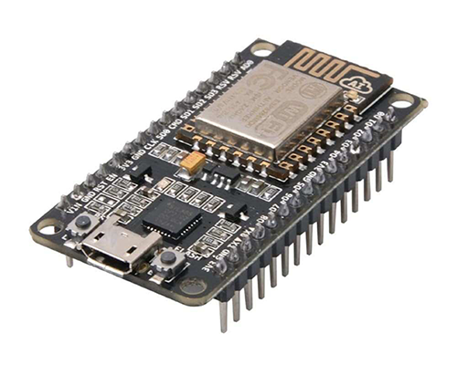

## Hardware Utilizado

### **NodeMCU ESP8266: 1x**

### **Micro-servo: 1X MG90S**

### **Sensor de chuva: 1x FC-37 ou YL-83**

### **Sensor de temperatura e umidade**

### **LEDs: 2x (verde e vermelho)**

### **PaperSignal** [(Google Signal)](https://papersignals.withgoogle.com/static/files/umbrella.pdf)

### **Cabos jumper**

### **Protoboard: 1x 380 pontos**

### **Cabo USB: 1x A/MicroB**

### **Montagem**

### **Esquema Eletrônico**

### **Materiais para confecção (utilizado para recorte e colagem da dobradura do guarda-chuva**

