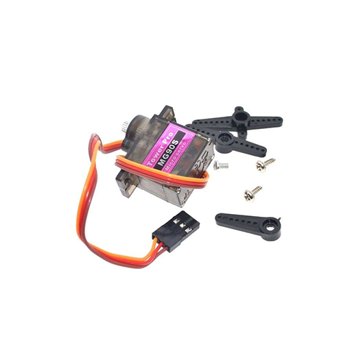

## Hardware Utilizado

### **NodeMCU**

### **Micro-servo**

### **Sensor de chuva**

### **Sensor de temperatura e umidade**

### **LEDs**

### **PaperSignal** [(Google Signal)](https://papersignals.withgoogle.com/)

### **Cabos jumper**

