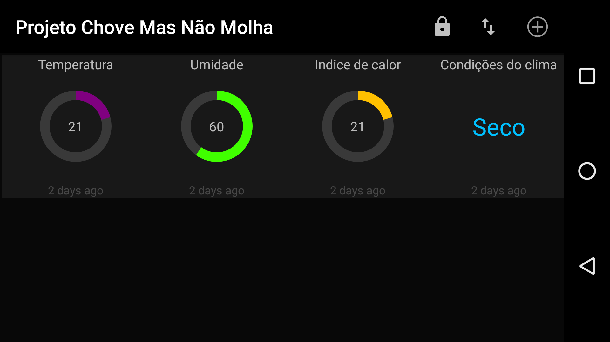
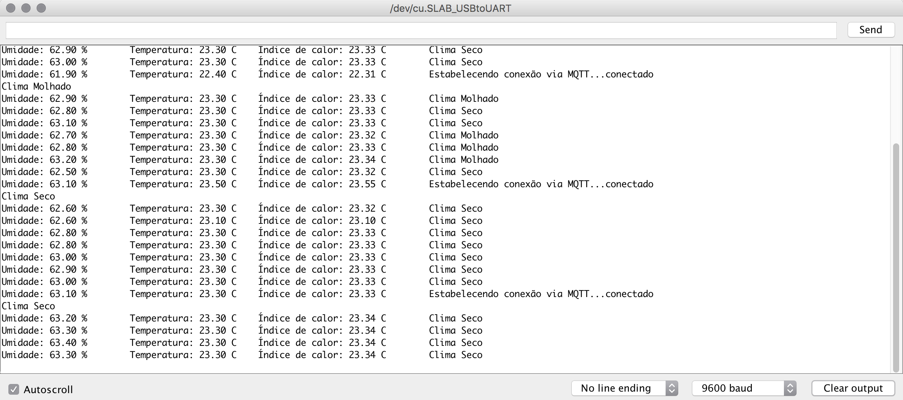

# Documentação das Interfaces Gráficas (GUI)

## Aplicativos para Android ou IOS
----------------------
* [MQTT Dash] for Android(https://play.google.com/store/apps/details?id=net.routix.mqttdash)

## Rede e Hardware

### Hardware
----------------------
* NodeMCU ESP8266
* Sensor de chuva (YL-83 ou FC-37)
* Micro-Servo
* Sensor de temperatura e umidade (DHT22)
* LED (1x verde, 1x vermelho)
* Protoboard (380 pontos)
* Cabo USB A/microB
* Cabos jumper

## Protocolos
----------------------
* Wifi

### Protocolos na camada de aplicação
----------------------
* MQTT
* HTTP

### Protocolos de comunicação USB-Serial
----------------------
* USB

